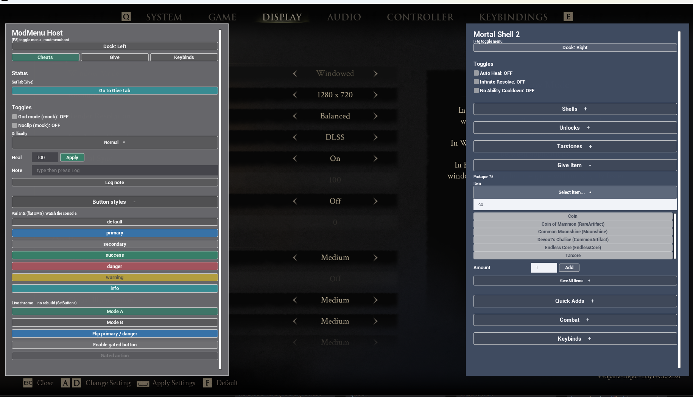

# ModMenu

ModMenu is a lightweight UI framework for UE4SS Lua mods that lets feature modules register reusable in-game settings panels without each mod reimplementing its own ImGui or UMG shell.



*Beast of Reincarnation: `DevToolsMasterMod` (F6, left) and `TestMod` (F7, right) — two independent ModMenu shells in one session.*

Each **enabled Lua mod** that calls `Init` gets its own panel + hotkey. Feature modules **register sections** into that mod’s shell.

UObject names are unique across mods via `ModRef` shared vars (see `instanceId`), so two mods can both ship a ModMenu without stealing `ModMenu_Root_1`.

Example hosts (not in this repo — live under a game’s `ue4ss/Mods/`): `DevToolsMasterMod` (F6), `TestMod` (F7).

---

## Install (players / Nexus)

Build from this repo:

```bash
npm run deploy
```

Extract `dist/ModMenu.zip` into `ue4ss/Mods/`. No rename — the zip already contains the correct path:

```
ue4ss/Mods/
  shared/
    ModMenu/
      ModMenu.lua           ← bundled runtime (from ModMenu.zip)
    UEHelpers/              ← already part of normal UE4SS layouts
  YourHostMod/
    enabled.txt
    Scripts/
      main.lua              ← Init + Register feature modules
      myfeature.lua         ← optional: section logic
```

Require path (same style as UEHelpers):

```lua
local ModMenu = require("ModMenu.ModMenu")
```

The host mod must be enabled (`enabled.txt` / `mods.txt`). ModMenu is loaded via `require` from `shared/`; it is not a separate enabled mod.

Also produced for tooling: `dist/ModMenu.bundle.lua` and `dist/release/shared/ModMenu/ModMenu.lua`.  
`UEHelpers` is **not** bundled — leave the stock UE4SS copy under `Mods/shared/`.  
Omit this repo’s `README.md` / `GithubAssets/` from player zips (use Nexus gallery images instead).

### Source layout (contributors)

Development uses the multi-file tree (what you edit in this repo):

```
ModMenu.lua                 ← public API + shell
core/                       ← util, umg, input, options
widgets/                    ← one module per item type + registry
tools/
  bundle.mjs                ← npm run bundle
  deploy.mjs                ← npm run deploy → dist/ModMenu.zip
```

When adding a widget or core module, register it in `tools/bundle.mjs` (`MODULES`) so releases stay complete.

---

## Recommended pattern

**Within one mod:** that mod owns one shell; feature scripts only call `Register` / `Get` / `Set` / etc.  
**Across mods:** each enabled Lua mod may `Init` its own independent shell (separate hotkey / dock / `instanceId`).

### Host — `Scripts/main.lua`

```lua
local ModMenu = require("ModMenu.ModMenu")
local MyFeature = require("myfeature")

ModMenu.Init({
    title = "My Mod Menu",
    instanceId = "YourHostMod", -- unique FName tag (Live View: ModMenu_Root_YourHostMod_1)
    key = Key.F6,
    keyHint = "F6",
    dock = "left", -- "left" | "right"
})

MyFeature.RegisterMenu(ModMenu)

print("[YourHostMod] Loaded — F6 opens menu")
```

Use a **different toggle key** per mod if several menus may run together (e.g. F6 + F7).

On bind, ModMenu claims `ModMenu.KeyClaim.<keyHint>` via `ModRef`. If another instance already claimed that hint, it logs **KEY CONFLICT** (still binds — warn only). UE4SS may invoke every binder on that key, so same-key menus can open together (handy for same-author left/right docks; risky for unrelated mods).

### Feature — `Scripts/myfeature.lua`

```lua
local M = {}

---@param ModMenu table
function M.RegisterMenu(ModMenu)
    ModMenu.Register({
        id = "MyFeature",           -- stable unique id (re-Register replaces)
        title = "My Feature",       -- section header
        items = {
            {
                type = "label",
                label = "Short hint for players.",
            },
            { type = "separator" },
            {
                type = "button",
                id = "doThing",
                label = "Do thing",
                onClick = function()
                    -- your game logic
                end,
            },
            {
                type = "checkbox",
                id = "enabled",
                label = "Enabled",
                default = false,
                onChange = function(on)
                    print("enabled = " .. tostring(on))
                end,
            },
            {
                type = "dropdown",
                id = "mode",
                label = "Mode",
                options = {
                    "Simple",
                    { label = "Advanced", value = "adv" },
                },
                default = "Simple",
                onChange = function(value)
                    print("mode = " .. tostring(value))
                end,
            },
        },
    })
end

return M
```

### Why this shape?

| Role | Responsibility |
|------|----------------|
| Host | `Init` once (title, key, dock), wire features |
| Feature module | Own section `id`, items, callbacks, game calls |
| ModMenu | Draw panel, input, values store, dock |

Shipping extra cheats later = add another `*.lua` + one `RegisterMenu` call in the host.

**Multi-mod:** any number of mods may `Init` their own shell. Each gets a process-wide instance serial (`ModMenu.NextInstanceId` shared var) and optional `instanceId` tag so Live View shows distinct roots (`ModMenu_Root_DevTools_1`, `ModMenu_Root_TestMod_1`). Closing one menu will not force GameOnly input while another ModMenu is still open.

---

## API

### `ModMenu.Init(opts?)`

Configure and bind this mod’s shell. Safe to call more than once (updates config).

| Option | Default | Notes |
|--------|---------|--------|
| `title` | `"Mod Menu"` | Header title |
| `instanceId` | `"iN"` | FName tag; set once before first shell create (e.g. `"TestMod"`) |
| `key` | `Key.F6` | Toggle key (use a unique key per mod) |
| `keyHint` | `"F6"` | Shown in the header hint |
| `dock` | `"right"` | `"left"` \| `"right"` |
| `widthFrac` | `0.32` | Panel width as % of viewport |
| `topFrac` / `bottomFrac` | `0.05` | Vertical margins |
| `rightFrac` | `0.01` | Edge margin (both docks) |
| `fontTitle` / `fontHint` / `fontItem` / `fontSection` / `fontDropdown` | 32 / 20 / 24 / 26 / 22 | Optional. `fontDropdown` is header + option rows; match `fontItem` to size dropdowns like buttons. |
| `canOpen` | `nil` | Optional `function(): boolean` or `false, "reason"`. Gates **open** (key toggle + `ModMenu.Open`); close is never gated. Pass `false` on a later `Init` to clear. |
| `ignoreLook` | `false` | Opt-in. While open, `SetIgnoreLookInput(true)` so mouse-look games do not spin the camera. Default off — hosts that need a locked camera must pass `true`. |

Also installs viewport hooks, LMB click latch, and the toggle keybind.

```lua
-- Keep F7 bound, but only open when another menu allows it:
ModMenu.Init({
    title = "Dev Tools",
    key = Key.F7,
    keyHint = "F7",
    canOpen = function()
        if not cheatMenuOpen then
            return false, "Open the cheat menu first"
        end
        return true
    end,
})

-- Host can still drive the shell explicitly:
--   ModMenu.Open()   -- also respects canOpen
--   ModMenu.Close()  -- always allowed
```

`ModMenu.GetInstanceId()` / `ModMenu.GetInstanceSerial()` — debug helpers for logs / Live View.

### `ModMenu.Register(section)`

Add or **replace** a section by `section.id`. If the menu is open, content rebuilds.

```lua
{
  id = "UniqueId",       -- required
  title = "Display",     -- optional; defaults to id
  items = { ... },       -- required array
}
```

### Values

```lua
ModMenu.Get(sectionId, itemId)           -- checkbox bool / dropdown value
ModMenu.Set(sectionId, itemId, value)    -- sync store + live widget
```

Keys are stored as `"SectionId.itemId"`.

### Labels

```lua
ModMenu.SetLabel(sectionId, itemId, "New text")
```

Label items need an `id` for this to work.

### Buttons

```lua
ModMenu.SetButtonLabel(sectionId, itemId, "Scanning...")
ModMenu.SetButtonEnabled(sectionId, itemId, false)  -- blocks poll clicks + UMG SetIsEnabled
```

Button items need an `id`. Optional Register field: `enabled = false` (default true).

### Dropdown options

```lua
-- Replace options; optionally set or clear selection
ModMenu.SetOptions(sectionId, itemId, options, selectedValue)
ModMenu.SetOptions(sectionId, itemId, options, false)  -- clear selection
```

- Searchable dropdowns refresh rows **in place** when the menu is open.
- Non-searchable dropdowns rebuild the panel.

### Lifecycle

```lua
ModMenu.OnOpen(function()
    -- lazy load DBs, refresh status, etc.
end)

ModMenu.Open()
ModMenu.Close()
ModMenu.Toggle()
ModMenu.IsOpen()           -- boolean
ModMenu.ListSections()     -- { "MaxRank", "Items", ... }
ModMenu.SetDock("left")
ModMenu.GetDock()
```

`OnOpen` runs each time the menu finishes opening (after the shell is visible). Register as many callbacks as you need (e.g. one per feature).

---

## Extending: widget contract

Item types live under `widgets/`. The shell never hard-codes control UMG — it asks the registry.

### Contract

Each widget module returns a table:

| Field | Required | Role |
|-------|----------|------|
| `type` | yes | String id (`"button"`, …) |
| `validate(item, sectionId, index)` | no | Throw on bad Register fields |
| `seed(sectionId, item, values)` | no | Default into values store on Register |
| `build(ctx)` | yes | Construct UMG; append to `ctx.liveControls` |
| `poll(ctrl, ctx)` | no | Continuous tick (checkbox state, search filter) |
| `pollClick(ctrl, ctx)` | no | LMB click handler; return `true` if consumed |
| `apply(ctrl, value, ctx)` | no | Sync live widget from `ModMenu.Set` / `SetLabel` |

Dropdown also exposes helpers used by the shell (`refreshLive`, `collapseAll`, …).

### Build `ctx`

| Field | Purpose |
|-------|---------|
| `contentBox` | Parent vertical box |
| `section` / `item` | Current section + item |
| `namePrefix` | Unique FName prefix |
| `values` / `liveControls` | Shared store + control records |
| `config` | Fonts / layout from `Init` |
| `umg` | `ModMenu.core.umg` |
| `Input` | `ModMenu.core.input` |
| `ValueKey` / `SafeCall` / `IsValid` | Helpers |
| `ReclaimMenuInput` / `EnsureMenuVisible` | Shell input helpers |

### Adding a new type (PR checklist)

1. Create `widgets/<type>.lua` implementing the contract (copy `button.lua` or `checkbox.lua`).
2. `register(require("ModMenu.widgets.<type>"))` in `widgets/init.lua`.
3. Add the module to `MODULES` in `tools/bundle.mjs`.
4. Document fields under **Item types** below.
5. Smoke-test via a host `Register` section, then `npm run deploy`.

Natural follow-ons (not required for hosts): tabbed sections, `slider` / stepper polish — same contract as above.

---

## Item types

Supported: `checkbox` | `button` | `dropdown` | `label` | `separator` | `number` | `textinput` | `row`  
(Implemented in `widgets/<type>.lua`.)

### `separator`

```lua
{ type = "separator" }
```

### `label`

```lua
{ type = "label", label = "Hint text" }
{ type = "label", id = "status", label = "Ready" }  -- id required for SetLabel
```

### `button`

```lua
{
  type = "button",
  id = "run",
  label = "Do thing",
  enabled = true,  -- optional; false disables clicks / greys out
  onClick = function() end,
}
```

Use `SetButtonLabel` / `SetButtonEnabled` for busy states (e.g. “Scanning…”).

### `checkbox`

```lua
{
  type = "checkbox",
  id = "enabled",
  label = "Enabled",
  default = false,
  onChange = function(checked) end,
}
```

### `dropdown`

Options may be plain strings or `{ label, value }` tables:

```lua
options = {
  "A",
  { label = "Bee", value = "b" },
}
```

**Simple (short lists):**

```lua
{
  type = "dropdown",
  id = "mode",
  label = "Mode",
  options = { "A", "B" },
  default = "A",
  onChange = function(value) end,
}
```

**Searchable (long lists — filter field + scroll):**

```lua
{
  type = "dropdown",
  id = "item",
  label = "Item",
  searchable = true,
  placeholder = "Select item...",
  maxVisible = 400,      -- cap on built option rows (raise carefully)
  listMaxHeight = 320,   -- scroll area height
  allowEmpty = true,     -- ok with no selection / empty filter results
  options = { { label = "Potion", value = "ITEM_ID" }, ... },
  default = nil,
  onChange = function(value) end,
}
```

| Field | Notes |
|-------|--------|
| `searchable` | Custom picker (not ComboBoxString) |
| `maxVisible` | Max option rows constructed; leftover shows “type to narrow” |
| `listMaxHeight` | ScrollBox height hint |
| `allowEmpty` | Allow cleared / placeholder state |
| `placeholder` | Header text when nothing selected |

### `number`

Labeled numeric field. Value is stored as a Lua number (`Get` / `Set`). Invalid mid-edit text is ignored until a parseable number is typed.

```lua
{
  type = "number",
  id = "count",
  label = "Count",
  default = 1,
  min = 1,
  max = 999,
  integer = true,       -- round to nearest int
  placeholder = "1",    -- hint when empty
  fieldWidth = 72,      -- EditableTextBox width
  labelWidth = 156,     -- optional; same width on every row = table-aligned fields
  debounceMs = 250,     -- delay onChange only (default 250; 0 = immediate). Get stays live.
  onChange = function(n) end,
}
```

### `textinput`

Labeled string field.

```lua
{
  type = "textinput",
  id = "name",
  label = "Name",
  default = "",
  placeholder = "Enter name...",
  maxLength = 32,
  fieldWidth = 200,
  labelWidth = 156,     -- optional; align stacked fields
  debounceMs = 250,     -- delay onChange only (default 250; 0 = immediate). Get stays live.
  onChange = function(text) end,
}
```

`Get` / button `onClick` always see the latest parsed value. Only `onChange` waits for typing to pause.

### `row`

Horizontal group. Children share one line (Unity-style Count + field + button).

Allowed children: `button` | `checkbox` | `label` | `number` | `textinput`  
(Not: nested `row`, `dropdown`, `separator`.)

```lua
{
  type = "row",
  items = {
    {
      type = "number",
      id = "count",
      label = "Count",
      default = 1,
      min = 1,
      integer = true,
    },
    {
      type = "button",
      id = "addSelected",
      label = "Add Selected",
      onClick = function()
        local item = ModMenu.Get("Items", "item")
        local count = ModMenu.Get("Items", "count")
        -- grant / spawn
      end,
    },
  },
}
```

Pair with a searchable `dropdown` above the row for the classic select → count → submit flow.

For stacked amount rows, set the same `labelWidth` + `fieldWidth` on every `number` so the fields line up.

---

## Dynamic UI patterns

### Update options without rebuilding the whole section

```lua
ModMenu.SetOptions("Items", "item", newOpts, false)
ModMenu.Set("Items", "item", nil)
```

Prefer this for category filters on a searchable list (see DevTools `items.lua`).

### Swap which controls exist

Re-call `Register` with the same `id` and a new `items` array (e.g. show Category only for English). Values for ids that still exist are kept when possible; seed `default` on first register.

### Lazy work on open

```lua
ModMenu.OnOpen(function()
    if alreadyLoaded then return end
    ExecuteWithDelay(50, function()
        -- fetch DB, then SetOptions / SetLabel / Register
    end)
end)
```

Heavy work on the click stack can hitch or crash — delay off the open path when loading large lists.

---

## Behaviour notes (for integrators)

1. **Per-mod shell** — each Lua mod has its own ModMenu state (`require` is not shared across mods). Multiple mods may each `Init` an independent panel. UObject roots are named `ModMenu_Root_<instanceId>_<n>` using a `ModRef` serial (`ModMenu.NextInstanceId`) so they never collide under `GameInstance`.
2. **Toggle keys** — prefer a unique `key` / `keyHint` per mod. Claims are stored as `ModMenu.KeyClaim.<keyHint>`; clashes log **KEY CONFLICT**. UE4SS may fire every binder on that key (both menus toggle — useful for same-author dual docks, confusing for unrelated mods).
3. **Input** — while open, uses GameAndUI + mouse cursor. Clicks use LMB keybind latch + `IsHovered()` (not UE `OnClicked` alone). Closing one menu does not force GameOnly while another ModMenu is still open (`ModMenu.OpenCount`). `ClientRestart` / `DestroyShell` do not touch input unless this instance had the menu open. On close, `GameOnly` is applied only if the game had no cursor when we opened (mouse-look); hub/inventory cursors are left alone. Camera look is **not** locked unless `Init({ ignoreLook = true })`.
4. **Dock** — left/right presets only (header button + `SetDock`). No free drag. Session only (not saved to disk).
5. **Scroll** — the docked panel is a fixed viewport; section content lives in a ScrollBox (mouse wheel). Use `labelWidth` on `number` / `textinput` so amount rows line up like a table.
6. **FNames** — shell names include `instanceId`; content rebuilds bump an internal generation after `ClearChildren`. Prefer `SetOptions` on searchable lists over constant full rebuilds.
7. **Large lists** — keep `maxVisible` bounded; filter narrows the working set. Building thousands of UButtons at once is risky.
8. **Game readiness** — many game objects only exist after a save is loaded; surface that in a status `label` and/or `OnOpen` retry.
9. **Callbacks** — errors inside `onClick` / `onChange` are caught and logged as `[ModMenu] callback error: ...`.
10. **Hot-reload** — `ModRef` shared vars (`NextInstanceId`, key claims, open count) are **not** cleared on Ctrl+R.

---

## Minimal standalone host

If you only need one section and no feature files:

```lua
-- Mods/MyCheatMenu/Scripts/main.lua
local ModMenu = require("ModMenu.ModMenu")

ModMenu.Init({
    title = "My Cheats",
    instanceId = "MyCheatMenu",
    key = Key.F7,
    keyHint = "F7",
    dock = "right",
})

ModMenu.Register({
    id = "Cheats",
    title = "Cheats",
    items = {
        {
            type = "button",
            id = "heal",
            label = "Heal",
            onClick = function()
                -- ...
            end,
        },
    },
})
```

Ship `MyCheatMenu/` plus ModMenu from `npm run deploy` (`dist/ModMenu.zip` → extract into `ue4ss/Mods/`). See **Install** above.

---

## See also

- Install / Nexus zip: `npm run deploy` → `dist/ModMenu.zip`
- Widget registry: `widgets/init.lua`
- Public API / shell: `ModMenu.lua`
- Example game hosts (external): `DevToolsMasterMod` (multi-section), `TestMod` (minimal + key-conflict smoke flag)
