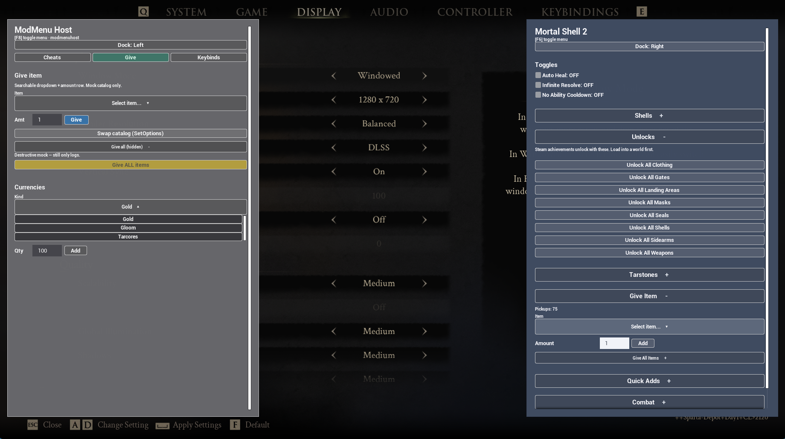

# ModMenu

ModMenu is a lightweight UI framework for UE4SS Lua mods that lets feature modules register reusable in-game settings panels without each mod reimplementing its own ImGui or UMG shell.


*Mortal Shell 2: `ModMenuHost` (F8, left) and `MortalShell2Mod` (F6, right). Dummy Cheats tab (widgets, button variants) beside a real Give list — two shells, two keys, one session.*

Each **enabled Lua mod** that calls `Init` gets its own panel + hotkey. Feature modules **register sections** into that mod’s shell.

UObject names are unique across mods via `ModRef` shared vars (see `instanceId`), so two mods can both ship a ModMenu without stealing `ModMenu_Root_1`.



*Same session, different pages: Host on **Give** (search, amount row, warning action) while the cheat menu has **Unlocks** open. Tabs and collapse are per-shell.*

Showcase dummy: `examples/ModMenuHost.lua` (copy into `ue4ss/Mods/YourMod/Scripts/main.lua`). Game-side example: `MortalShell2Mod` (not in this repo).

---

## Install (players / Nexus)

Build from this repo:

```bash
npm run deploy
```

Extract `dist/ModMenu.zip` into `ue4ss/Mods/`. No rename — the zip already contains the correct path:

```
ue4ss/Mods/
  shared/
    ModMenu/
      ModMenu.lua           ← bundled runtime (from ModMenu.zip)
    UEHelpers/              ← already part of normal UE4SS layouts
  YourHostMod/
    enabled.txt
    Scripts/
      main.lua              ← Init + Register feature modules
      myfeature.lua         ← optional: section logic
```

Require path (same style as UEHelpers):

```lua
local ModMenu = require("ModMenu.ModMenu")
```

The host mod must be enabled (`enabled.txt` / `mods.txt`). ModMenu is loaded via `require` from `shared/`; it is not a separate enabled mod.

Also produced for tooling: `dist/ModMenu.bundle.lua` and `dist/release/shared/ModMenu/ModMenu.lua`.  
`UEHelpers` is **not** bundled — leave the stock UE4SS copy under `Mods/shared/`.  
Omit this repo’s `README.md` / `GithubAssets/` from player zips (use Nexus gallery images instead).

### Source layout (contributors)

Development uses the multi-file tree (what you edit in this repo):

```
ModMenu.lua                 ← public API facade
ConfigManager.lua           ← shim: require("ModMenu.ConfigManager") → core/store.lua
core/                       ← util, theme, umg, shared, config, store, instance, input, …
shell/                      ← session, dock, collapse, tabs, build, lifecycle, registry
widgets/                    ← one module per item type + registry
tools/                      ← node: bundle.mjs, deploy.mjs
tooling/                    ← C# CLI + tests (not in ModMenu.zip)
```

`widgets/*.lua` are auto-bundled. New `core/` or `shell/` files still need a `MODULES` row in `tools/bundle.mjs`.

UX / north star: `vision.md` (shipped; leftovers are optional).

---

## Recommended pattern

**Within one mod:** that mod owns one shell; feature scripts only call `Register` / `Get` / `Set` / etc.  
**Across mods:** each enabled Lua mod may `Init` its own independent shell (separate hotkey / dock / `instanceId`).

### Host — `Scripts/main.lua`

```lua
local ModMenu = require("ModMenu.ModMenu")
local MyFeature = require("myfeature")

ModMenu.Init({
    title = "My Mod Menu",
    instanceId = "YourHostMod", -- unique FName tag (Live View: ModMenu_Root_YourHostMod_1)
    key = Key.F6,
    keyHint = "F6",
    dock = "left", -- "left" | "right" | "top" | "bottom" (starting edge; user can change)
    -- theme = "dark", -- charcoal panel; omit for the current ("light") look
    -- tabs = { "Cheats", "Give", "Keybinds" }, -- omit = single scroll
    -- debug = true, -- verbose [ModMenu] traces (open/close, collapse, register, click path)
    -- pointerMode = "touch", -- Ally: checkbox as tap buttons; ignore late LMB latch
    -- inputBackend = "engine", -- opt-in when RegisterKeyBind does not fire
    -- consoleCommand = "modmenu",
    -- cursorMode = "modmenu", -- overlay pointer when the game hides the engine cursor
    -- cursorScale = 1, -- overlay pointer size (1 = native ~28x46; 2 = larger)
    -- fontScale = 1.25, -- multiply default font sizes (per-game). fontTitle / fontItem / … still override.
})

MyFeature.RegisterMenu(ModMenu)

print("[YourHostMod] Loaded — F6 opens menu")
```

Use a **different toggle key** per mod if several menus may run together (e.g. F6 + F7).

On bind, ModMenu claims `ModMenu.KeyClaim.<keyHint>` via `ModRef`. If another instance already claimed that hint, it logs **KEY CONFLICT** (still binds — warn only). UE4SS may invoke every binder on that key, so same-key menus can open together (handy for same-author left/right docks; risky for unrelated mods).

### Feature — `Scripts/myfeature.lua`

```lua
local M = {}

---@param ModMenu table
function M.RegisterMenu(ModMenu)
    ModMenu.Register({
        id = "MyFeature",           -- stable unique id (re-Register replaces)
        title = "My Feature",       -- section header
        items = {
            {
                type = "label",
                label = "Short hint for players.",
            },
            { type = "separator" },
            {
                type = "button",
                id = "doThing",
                label = "Do thing",
                onClick = function()
                    -- your game logic
                end,
            },
            {
                type = "checkbox",
                id = "enabled",
                label = "Enabled",
                default = false,
                onChange = function(on)
                    print("enabled = " .. tostring(on))
                end,
            },
            {
                type = "dropdown",
                id = "mode",
                label = "Mode",
                options = {
                    "Simple",
                    { label = "Advanced", value = "adv" },
                },
                default = "Simple",
                onChange = function(value)
                    print("mode = " .. tostring(value))
                end,
            },
        },
    })
end

return M
```

### Why this shape?

| Role | Responsibility |
|------|----------------|
| Host | `Init` once (title, key, dock), wire features |
| Feature module | Own section `id`, items, callbacks, game calls |
| ModMenu | Draw panel, input, values store, dock |

Shipping extra cheats later = add another `*.lua` + one `RegisterMenu` call in the host.

**Multi-mod:** any number of mods may `Init` their own shell. Each gets a process-wide instance serial (`ModMenu.NextInstanceId` shared var) and optional `instanceId` tag so Live View shows distinct roots (`ModMenu_Root_DevTools_1`, `ModMenu_Root_TestMod_1`). Closing one menu will not force GameOnly input while another ModMenu is still open.

---

## API

### `ModMenu.Init(opts?)`

Configure and bind this mod’s shell. Safe to call more than once (updates config).

| Option | Default | Notes |
|--------|---------|--------|
| `title` | `"Mod Menu"` | Header title |
| `instanceId` | `"iN"` | FName tag; set once before first shell create (e.g. `"TestMod"`) |
| `key` | `Key.F6` | Toggle key for the `ue4ss` backend (use a unique key per mod) |
| `keyHint` | `"F6"` | Shown in the header hint |
| `keyName` | from `keyHint` | Unreal `FKey` name for the `engine` backend (e.g. `"F7"`). Required when `keyHint` is not a plain name. |
| `inputBackend` | `"ue4ss"` | `"ue4ss"` (RegisterKeyBind) or `"engine"` (poll `IsInputKeyDown`). Opt-in — no auto-detect. Same backend for toggle **and** LMB. |
| `consoleCommand` | `nil` | Optional. Registers `name [toggle/open/close]`. Do not also register the same command in the host. |
| `dock` | `"right"` | `"left"` \| `"right"` \| `"top"` \| `"bottom"`. Author default. Header dropdown offers all four. Same panel footprint, rotated 90° for top/bottom (`widthFrac` is thickness). |
| `widthFrac` | `0.32` | Panel thickness as % of viewport (width on left/right; height on top/bottom) |
| `topFrac` / `bottomFrac` | `0.05` | Long-axis margins (vertical on left/right; horizontal on top/bottom) |
| `rightFrac` | `0.01` | Thickness-edge gap (all four docks) |
| `fontScale` | `1` | Multiplies the default font sizes (same idea as UE4SS `GuiConsoleFontScaling`). Prefer this for per-game **desktop** tuning. Explicit `fontTitle` / … still win and are not scaled by this. |
| `fontTitle` / `fontHint` / `fontItem` / `fontSection` / `fontDropdown` | 22 / 14 / 16 / 18 / 15 | Optional absolute sizes. Omit and use `fontScale` unless one role needs a one-off size. `fontDropdown` is header + option rows. |
| `touchFontScale` | `1.75` | Used only when `pointerMode` is `"touch"`. Multiplies resolved fonts **and** desktop `widthFrac` (0.32 → ~0.56, cap 0.85). Mortal Shell 2 `fontItem = 10` becomes 18. Not stacked across later `Init` calls. |
| `theme` | `"light"` | Author preset. `"light"` is the current look (navy panel, light fields). `"dark"` is charcoal panel, dark fields, teal/gold tokens. Not a player setting. |
| `colors` | from `theme` | Optional overrides: `{ panelBg = { R, G, B, A }, ... }`. Merged onto the preset. See **Theming**. |
| `tabs` | `nil` | Optional `{ "Cheats", "Give", ... }`. Adds a tab strip; only the active tab's sections are built. Omit = current single-scroll menu. Duplicate / empty names error. |
| `canOpen` | `nil` | Optional `function(): boolean` or `false, "reason"`. Gates **open** (key toggle + `ModMenu.Open`); close is never gated. Pass `false` on a later `Init` to clear. |
| `ignoreLook` | `false` | Opt-in. While open, `SetIgnoreLookInput(true)` so mouse-look games do not spin the camera. Default off — hosts that need a locked camera must pass `true`. |
| `cursorMode` | `"engine"` | `"engine"` (PlayerController / GameAndUI cursor only) or `"modmenu"` (opt-in HitTestInvisible overlay pointer above the shell). Use when the game suppresses the engine cursor. A later `Init` that changes this (or `cursorScale` / `cursorHideClasses`) rebuilds the overlay if it already exists. |
| `cursorScale` | `1` | Overlay pointer multiplier (`1`–`8`). The glyph is the Windows arrow (~28×46) with a 1px outline + drop shadow. `2` if you want it larger. Only used when `cursorMode = "modmenu"`. Live `Init` updates rebuild the overlay. |
| `cursorHideClasses` | `nil` | Optional string array of UUserWidget class short names to collapse while the ModMenu cursor is shown (e.g. `{ "WB_Cursor_C" }`). Host-supplied; empty by default. Class defaults (`Default__…`) are skipped. On close, each widget is restored to the visibility it had before hide — not forced visible. |
| `debug` | `false` | Verbose `[ModMenu]` traces (open/close, collapse, register, click routing). Failures always print. |
| `pointerMode` | `"mouse"` | `"mouse"` (default) or `"touch"` / `"handheld"` (same). Touch: ignore delayed LMB latch; checkbox ON/OFF buttons; fonts + panel width × `touchFontScale`; 28px scrollbar; 56px-tall tab strip with extra gap under Dock. Hosts keep `{ type = "checkbox" }` and desktop `font*` / `widthFrac`. |

Also installs viewport hooks and the input backend (`core/input.lua`): toggle + LMB click latch. Default `ue4ss` uses `RegisterKeyBind`. Pass `inputBackend = "engine"` on games where those binds never fire (e.g. Code Vein 2); that polls Unreal `IsInputKeyDown` for the toggle key and left mouse.

```lua
-- Games where RegisterKeyBind does not fire:
ModMenu.Init({
    title = "My Cheats",
    key = Key.F7,
    keyHint = "F7",
    keyName = "F7",
    inputBackend = "engine",
    consoleCommand = "modmenu",
    ignoreLook = true,
})
```

```lua
-- Games that hide / replace the engine cursor (overlay pointer):
ModMenu.Init({
    title = "Give Item Cmd",
    instanceId = "GiveItemCmd",
    key = Key.F6,
    keyHint = "F6",
    ignoreLook = true,
    cursorMode = "modmenu",
    cursorHideClasses = { "WB_Cursor_C", "WB_CursorHidden_C" },
})
-- Wuchang: close the menu before death / area load. ClientRestart with the
-- shell open fatals in that title only; other games restore the menu fine.
```

```lua
-- Keep F7 bound, but only open when another menu allows it:
ModMenu.Init({
    title = "Dev Tools",
    key = Key.F7,
    keyHint = "F7",
    canOpen = function()
        if not cheatMenuOpen then
            return false, "Open the cheat menu first"
        end
        return true
    end,
})

-- Host can still drive the shell explicitly:
--   ModMenu.Open()   -- also respects canOpen
--   ModMenu.Close()  -- always allowed
```

`ModMenu.GetInstanceId()` / `ModMenu.GetInstanceSerial()` — debug helpers for logs / Live View.

### `ModMenu.Register(section)`

Add or **replace** a section by `section.id`. If the menu is open, content rebuilds.

```lua
{
  id = "UniqueId",       -- required
  title = "Display",     -- optional; defaults to id
  tab = "Cheats",        -- optional; requires Init({ tabs = { ... } }); omit = first tab
  collapsible = false,   -- optional; accordion header (title left, + / - right)
  collapsed = false,     -- optional; start closed (requires collapsible = true)
  -- onToggle = function(collapsed) end,  -- optional
  items = { ... },       -- required array (may include type = "fold")
}
```

Default is **not** collapsible — existing sections stay always-open. Session remembers open/closed per `id` (re-Register does not reset it; not saved to disk). Nest groups **inside** a section with `type = "fold"` (see **Item types**).

Omit `Init tabs` and the menu stays a single scroll (Mortal Shell 2 and other hosts unchanged). With tabs, only the **active** tab's sections are built — switching rebuilds content (values from `Get` / `Set` still live for hidden tabs). Last tab is session-only (survives close/open; not written to disk).

```lua
ModMenu.Init({
    title = "My Cheats",
    tabs = { "Cheats", "Give", "Keybinds" },
})

ModMenu.Register({
    id = "Combat",
    title = "Combat",
    tab = "Cheats",
    items = { ... },
})
```

```lua
ModMenu.Register({
    id = "Keybinds",
    title = "Keybinds",
    collapsible = true,
    collapsed = true, -- start hidden
    items = {
        { type = "label", label = "Set a key per action. Hidden until you open this section." },
    },
})
```

### Values

```lua
ModMenu.Get(sectionId, itemId)           -- checkbox bool / dropdown value
ModMenu.Set(sectionId, itemId, value)    -- sync store + live widget
```

Keys are stored as `"SectionId.itemId"`.

### Labels

```lua
ModMenu.SetLabel(sectionId, itemId, "New text")
```

Label items need an `id` for this to work.

### Buttons

```lua
ModMenu.SetButtonLabel(sectionId, itemId, "Scanning...")
ModMenu.SetButtonEnabled(sectionId, itemId, false)  -- no clicks + themed disabled chrome
ModMenu.SetButtonVariant(sectionId, itemId, "danger")  -- default|primary|secondary|success|danger|warning|info
ModMenu.SetButtonActive(sectionId, itemId, true)     -- selected/on (green)
```

Button items need an `id`. Optional Register fields: `enabled = false`, `variant = "primary"|"danger"|…`, `active = true`. Paint order: disabled, then active, then variant. `accent` is accepted as an alias of `primary`.

### Confirm

In-shell modal on the docked panel. Blocks other clicks until Cancel or Confirm. Closing the menu dismisses without running the action.

```lua
-- Declarative (preferred): onClick waits for Confirm
{
  type = "button",
  id = "giveAll",
  label = "Give All Items",
  variant = "danger",
  confirm = {
    title = "Give all items?",
    message = "Adds every pickup. This cannot be undone here.",
    confirmLabel = "Give all", -- optional, default "Confirm"
    cancelLabel = "Cancel",    -- optional
    -- variant = "danger",     -- optional; defaults to the button variant
  },
  onClick = function()
    -- only after Confirm
  end,
}

-- Imperative (dynamic copy)
ModMenu.Confirm({
    title = "Reveal all icons?",
    message = "Paints every map icon and autosaves.",
    confirmLabel = "Reveal all",
    variant = "danger",
    onConfirm = function()
        -- ...
    end,
    -- onCancel = function() end,
})

ModMenu.IsConfirmOpen()
```

### Dropdown options

```lua
-- Replace options; optionally set or clear selection
ModMenu.SetOptions(sectionId, itemId, options, selectedValue)
ModMenu.SetOptions(sectionId, itemId, options, false)  -- clear selection
```

- Searchable dropdowns refresh rows **in place** when the menu is open.
- Non-searchable dropdowns rebuild the panel.

### Lifecycle

```lua
ModMenu.OnOpen(function()
    -- lazy load DBs, refresh status, etc.
end)

ModMenu.Open()
ModMenu.Close()
ModMenu.Toggle()
ModMenu.IsOpen()           -- boolean
ModMenu.ListSections()     -- { "MaxRank", "Items", ... }
ModMenu.SetDock("left")
ModMenu.GetDock()
ModMenu.OnDockChange(function(side)
    -- persist with the host store if you want it next launch
end)
ModMenu.SetTab("Give")     -- requires Init({ tabs = ... })
ModMenu.GetTab()           -- nil when tabs are off
```

`OnOpen` runs each time the menu finishes opening (after the shell is visible). Register as many callbacks as you need (e.g. one per feature).

`OnDockChange` runs after the header picker or `SetDock` applies an edge. ModMenu does not write disk; hosts that want memory across launches save `side` and pass it back on `Init({ dock = ... })`.

### Persistence

Optional JSON store, same singleton either way:

```lua
local ModMenu = require("ModMenu.ModMenu")
local ConfigManager = ModMenu.ConfigManager
-- or: require("ModMenu.ConfigManager")

ConfigManager.Init({
    id = "YourHostMod",
    defaults = { dock = "right", keybinds = {} },
})

local dock = ConfigManager.Get("dock")
ModMenu.Init({ dock = dock })
ModMenu.OnDockChange(function(side)
    ConfigManager.Set("dock", side)
end)
```

`Init` the store **before** `ModMenu.Init` when launch options (dock, toggle key) come from disk. `Get` / `Set` / `Save` / `File` match the old standalone ConfigManager. Path is `Mods/<id>/config.json`. Hosts own what is written; ModMenu does not auto-save.

### Tests (no game)

```bash
npm test
# or: dotnet test tooling/ModMenu.sln
dotnet run --project tooling/CLI -- test
dotnet run --project tooling/CLI -- detect
```

Lua specs live in `tooling/lua/` (store, dock math, options). In-game `modmenu test --game` is not implemented yet.

---

## Extending: widget contract

Item types live under `widgets/`. The shell never hard-codes control UMG — it asks the registry. Do **not** `require` dropdown (or any widget type) from `ModMenu.lua`; the facade stays wire + public API. Host-facing `SetLabel` / `SetButtonLabel` / `SetButtonEnabled` / `SetButtonVariant` / `SetButtonActive` names stay.

### Contract

Each widget module returns a table:

| Hook | When |
|------|------|
| `type` | String id (`"button"`, …) — required |
| `validate(item, sectionId, index)` | `Register` — throw on bad fields |
| `seed(sectionId, item, values)` | `Register` — default into `values` |
| `build(ctx)` | `BuildContent` — construct UMG; append to `ctx.liveControls` |
| `poll(ctrl, ctx)` | every open-menu tick (checkbox, `IsPressed`, search) |
| `pollClick(ctrl, ctx)` | LMB latch rising edge; return `true` if consumed |
| `apply(ctrl, value, ctx)` | `ModMenu.Set` / `SetLabel` / live sync |

Dropdown also exposes helpers used by the registry (`refreshLive`, `collapseAll`, …).

### Build `ctx`

| Field | Purpose |
|-------|---------|
| `values` / `liveControls` | Shared store + control records |
| `config` | Fonts / layout from `Init` |
| `umg` | `ModMenu.core.umg` |
| `Input` | `ModMenu.core.input` |
| `ValueKey` / `SafeCall` / `IsValid` | Helpers |
| `ReclaimMenuInput` / `EnsureMenuVisible` | Shell input helpers |
| `contentBox` | Parent vertical box |
| `section` / `item` | Current section + item |
| `namePrefix` | Unique FName prefix |
| `layout` | `nil`, or `"horizontal"` inside a `row` |

### Adding a new type (PR checklist)

1. Create `widgets/<type>.lua` implementing the contract (copy `button.lua` or `checkbox.lua`).
2. `register(require("ModMenu.widgets.<type>"))` in `widgets/init.lua`.
3. Document fields under **Item types** below.
4. Smoke-test via a host `Register` section, then `npm run deploy`.

`widgets/*.lua` are auto-bundled — do not add a `MODULES` row for a new widget. New `core/` or `shell/` files still need one.

Natural follow-ons (not required for hosts): `slider` / stepper polish — same contract as above.

---

## Item types

Supported: `checkbox` | `button` | `dropdown` | `label` | `separator` | `number` | `textinput` | `row` | `fold`  
(Implemented in `widgets/<type>.lua`.)

### `separator`

```lua
{ type = "separator" }
```

### `label`

```lua
{ type = "label", label = "Hint text" }
{ type = "label", id = "status", label = "Ready" }  -- id required for SetLabel
-- Empty / whitespace-only labels are collapsed (no leftover gap). SetLabel("") hides the row; SetLabel("text") shows it again.
```

### `button`

```lua
{
  type = "button",
  id = "run",
  label = "Do thing",
  enabled = true,   -- optional; false blocks clicks + disabled chrome
  variant = "default", -- optional: default|primary|secondary|success|danger|warning|info
  active = false,   -- optional; true = selected/on (wins over variant)
  -- confirm = { title = "Are you sure?", message = "Cannot undo.", confirmLabel = "Do it" },
  onClick = function() end,
}
```

`confirm` opens an in-shell modal over the panel. `onClick` runs only after Confirm. Cancel or closing the menu does nothing. One confirm at a time (a new one dismisses the old as Cancel).

Use `SetButtonLabel` / `SetButtonEnabled` / `SetButtonVariant` / `SetButtonActive` for busy and toggle-on states.

| Variant | Use |
|---------|-----|
| `default` | Theme button (navy / charcoal) |
| `primary` | Main action (blue) |
| `secondary` | Muted gray |
| `success` | Positive confirm (green) |
| `danger` | Destructive (red) |
| `warning` | Caution / “Award ALL” (yellow) |
| `info` | Informational (cyan) |

`active = true` is **selected/on**, not a variant. Hover/pressed restyle is not implemented (constructed UButtons are flat). No outline / link variants (UMG fill only).

### `checkbox`

```lua
{
  type = "checkbox",
  id = "enabled",
  label = "Enabled",
  default = false,
  onChange = function(checked) end,
}
```

### `dropdown`

Options may be plain strings or `{ label, value }` tables:

```lua
options = {
  "A",
  { label = "Bee", value = "b" },
}
```

**Simple (short lists):**

```lua
{
  type = "dropdown",
  id = "mode",
  label = "Mode",
  options = { "A", "B" },
  default = "A",
  onChange = function(value) end,
}
```

**Searchable (long lists — filter field + scroll):**

```lua
{
  type = "dropdown",
  id = "item",
  label = "Item",
  searchable = true,
  placeholder = "Select item...",
  maxVisible = 400,      -- cap on built option rows (raise carefully)
  listMaxHeight = 320,   -- scroll area height
  allowEmpty = true,     -- ok with no selection / empty filter results
  options = { { label = "Potion", value = "ITEM_ID" }, ... },
  default = nil,
  onChange = function(value) end,
}
```

| Field | Notes |
|-------|--------|
| `searchable` | Custom picker (not ComboBoxString) |
| `maxVisible` | Max option rows constructed; leftover shows “type to narrow” |
| `listMaxHeight` | ScrollBox height hint |
| `allowEmpty` | Allow cleared / placeholder state |
| `placeholder` | Header text when nothing selected |
| `onExpand` | Optional `function(list)`. Fires when the picker opens. Option rows are built on first expand (not at menu build), so heavy lists can stay cheap until opened. |

### `number`

Labeled numeric field. Value is stored as a Lua number (`Get` / `Set`). Invalid mid-edit text is ignored until a parseable number is typed.

```lua
{
  type = "number",
  id = "count",
  label = "Count",
  default = 1,
  min = 1,
  max = 999,
  integer = true,       -- round to nearest int
  placeholder = "1",    -- hint when empty
  fieldWidth = 72,      -- EditableTextBox width
  labelWidth = 156,     -- optional; same width on every row = table-aligned fields
  debounceMs = 250,     -- delay onChange only (default 250; 0 = immediate). Get stays live.
  onChange = function(n) end,
}
```

### `textinput`

Labeled string field.

```lua
{
  type = "textinput",
  id = "name",
  label = "Name",
  default = "",
  placeholder = "Enter name...",
  maxLength = 32,
  fieldWidth = 200,
  labelWidth = 156,     -- optional; align stacked fields
  debounceMs = 250,     -- delay onChange only (default 250; 0 = immediate). Get stays live.
  onChange = function(text) end,
}
```

`Get` / button `onClick` always see the latest parsed value. Only `onChange` waits for typing to pause.

### `row`

Horizontal group. Children share one line (Unity-style Count + field + button).

Allowed children: `button` | `checkbox` | `label` | `number` | `textinput`  
(Not: nested `row`, `dropdown`, `separator`, `fold`. Put a `row` *inside* a `fold` instead.)

```lua
{
  type = "row",
  items = {
    {
      type = "number",
      id = "count",
      label = "Count",
      default = 1,
      min = 1,
      integer = true,
    },
    {
      type = "button",
      id = "addSelected",
      label = "Add Selected",
      onClick = function()
        local item = ModMenu.Get("Items", "item")
        local count = ModMenu.Get("Items", "count")
        -- grant / spawn
      end,
    },
  },
}
```

Pair with a searchable `dropdown` above the row for the classic select → count → submit flow.

For stacked amount rows, set the same `labelWidth` + `fieldWidth` on every `number` so the fields line up.

### `fold`

Nested collapsible group **inside** a section (keybind categories, extra tools, …). Same accordion chrome as section collapse (title left, `+` / `-` right). Body is always built; toggle only show/hides it.

Default is **collapsed** (`collapsed` omitted or `true`). Pass `collapsed = false` to start open.

Allowed children: `button` | `checkbox` | `dropdown` | `label` | `number` | `row` | `separator` | `textinput`  
(Not: nested `fold`. Put folds in a collapsible **section** instead.)

`id` is required. `Get` / `Set` / `SetLabel` / `SetButtonLabel` / `SetButtonEnabled` / `SetOptions` resolve fold children, including a control nested in a `row` inside a fold.

Open/closed is session-only per `sectionId.foldId` (same idea as section collapse: survives close/open and `ClientRestart`; not written to disk). Re-Register keeps the current state.

```lua
ModMenu.Register({
    id = "Keybinds",
    title = "Keybinds",
    collapsible = true,
    collapsed = true,
    items = {
        {
            type = "fold",
            id = "movement",
            label = "Movement",
            collapsed = true,
            items = {
                {
                    type = "dropdown",
                    id = "jump",
                    label = "Jump",
                    options = { "Space", "C", "Unbound" },
                    default = "Space",
                },
            },
        },
        {
            type = "fold",
            id = "combat",
            label = "Combat",
            items = {
                { type = "label", label = "Combat binds…" },
            },
        },
    },
})
```

---

## Dynamic UI patterns

### Update options without rebuilding the whole section

```lua
ModMenu.SetOptions("Items", "item", newOpts, false)
ModMenu.Set("Items", "item", nil)
```

Prefer this for category filters on a searchable list (see DevTools `items.lua`).

### Swap which controls exist

Re-call `Register` with the same `id` and a new `items` array (e.g. show Category only for English). Values for ids that still exist are kept when possible; seed `default` on first register. Rebuilds immediately if the menu is **open**. If the menu is closed after the first open, the next `Open` rebuilds.

### Lazy work on open

```lua
ModMenu.OnOpen(function()
    if alreadyLoaded then return end
    ExecuteInGameThreadWithDelay(50, function()
        -- fetch DB, then SetOptions / SetLabel / Register
    end)
end)
```

Heavy work on the click stack can hitch or crash — delay off the open path when loading large lists.

---

## Behaviour notes (for integrators)

1. **Per-mod shell** — each Lua mod has its own ModMenu state (`require` is not shared across mods). Multiple mods may each `Init` an independent panel. UObject roots are named `ModMenu_Root_<instanceId>_<n>` using a `ModRef` serial (`ModMenu.NextInstanceId`) so they never collide under `GameInstance`.
2. **Toggle keys** — prefer a unique `key` / `keyHint` per mod. Claims are stored as `ModMenu.KeyClaim.<keyHint>`; clashes log **KEY CONFLICT**. On the `ue4ss` backend, UE4SS may fire every binder on that key (both menus toggle — useful for same-author dual docks, confusing for unrelated mods). On `engine`, each shell polls independently.
3. **Input** — while open, uses GameAndUI + mouse cursor. Buttons / dock / dropdowns fire from `UButton:IsPressed()` (rising edge, 16ms poll) plus the LMB latch + `IsHovered()` fallback (touch also keeps the last hovered widget briefly and retries an unclaimed latch). Desktop checkboxes poll persistent `IsChecked()`. `pointerMode = "touch"` renders checkboxes as ON/OFF buttons so a finger tap uses the same press-edge path. The toggle key uses `Init inputBackend`: `ue4ss` (`RegisterKeyBind`) or `engine` (poll `IsInputKeyDown`). PlayerController often does **not** see LMB while Slate owns the mouse, so engine-backend menus must not rely on the LMB latch alone. Closing one menu does not force GameOnly while another ModMenu is still open (`ModMenu.OpenCount`). `ClientRestart` / `DestroyShell` do not touch input unless this instance had the menu open. On close, `GameOnly` is applied only if the game had no cursor when we opened (mouse-look); hub/inventory cursors are left alone. Camera look is **not** locked unless `Init({ ignoreLook = true })`. When the engine cursor is suppressed, opt in with `cursorMode = "modmenu"` for a HitTestInvisible overlay pointer (`core/cursor.lua`); optionally pass `cursorHideClasses` to collapse game cursor widgets while open (class defaults are skipped; prior visibility is restored on close). Overlay mode does not treat a hidden engine cursor as stolen (that would re-apply GameAndUI every tick and break checkboxes / text fields). A later `Init` that changes `cursorMode` / `cursorScale` / `cursorHideClasses` rebuilds the overlay if it already exists.
4. **Dock** — author `Init({ dock })` is the starting edge. Header dropdown offers Left / Right / Top / Bottom (`SetDock` accepts any of the four). Same rectangle rotated 90° (`widthFrac` stays thickness). No free drag. Session only unless the host persists (`OnDockChange` + saved `Init` dock).
5. **Scroll** — the docked panel is a fixed viewport; section content lives in a ScrollBox (mouse wheel). Use `labelWidth` on `number` / `textinput` so amount rows line up like a table.
6. **FNames** — shell names include `instanceId`; content rebuilds bump an internal generation after `ClearChildren`. Collapse / fold expand/collapse show/hide a body and do not rebuild. Prefer `SetOptions` on searchable lists over constant full rebuilds. Menu close/open keeps the UMG tree (no rebuild) so large sections (Give, keybinds) do not respawn on every toggle. `Register` / non-searchable `SetOptions` rebuild **while the menu is open**, and mark the tree dirty if they run while it is closed so the next `Open` rebuilds. `ClientRestart` destroys the shell and restores it if it was open.
7. **Large lists** — keep `maxVisible` bounded; filter narrows the working set. Building thousands of UButtons at once is risky.
8. **Game readiness** — many game objects only exist after a save is loaded; surface that in a status `label` and/or `OnOpen` retry.
9. **Callbacks** — errors inside `onClick` / `onChange` are caught and logged as `[ModMenu] callback error: ...`.
10. **Logging** — quiet by default. Failures still print (`CreateShell failed`, `KEY CONFLICT`, `OPEN blocked`). `Init({ debug = true })` restores open/close, collapse, register, scrollbar, and click-path traces (`press-edge` / `latch-hover` / `latch-miss`). Click traces include `hover` / `pressed` / `capture` / `downVia` / `ptr`. On a handheld, `downVia=capture` is the touch signature — see **Ally / handheld**.
11. **Hot-reload** — `ModRef` shared vars (`NextInstanceId`, key claims, open count) are **not** cleared on Ctrl+R.
12. **Collapse** — opt-in (`collapsible = true`). Accordion header: title on the left, `+` (closed) / `-` (open) on the right. Toggle show/hides the section body (same as dropdowns; no content rebuild). Session-only per section `id` (survives close/open; not written to disk). Re-Register keeps the current open/closed state. Nested groups use `type = "fold"` inside `items` — same session memory per `sectionId.foldId` (see **Item types**).
13. **Tabs** — opt-in (`Init({ tabs = { ... } })`). Strip under title / dock. Only the active tab's sections are constructed; switching rebuilds that body (not a hidden full tree). `Register({ tab = "Give" })`; omit `tab` = first name. `Get` / `Set` still work for hidden tabs. Session remembers the last tab (not disk). Keyboard Q/E is not in v1. `pointerMode = "touch"` makes the strip 56px tall with extra gap under Dock (desktop unchanged).

### Known limits

- Game-specific **input reclaim** (e.g. Thymesia `NativeUtils`, Wuchang `EnableMouse0`) remains **host responsibility**. `cursorMode = "modmenu"` only draws an overlay glyph; it does not replace per-game input adapters.
- **Wuchang:** close the menu before death or area load. `ClientRestart` with the shell open fatals in that title only (not cursor-related). Other games restore an already-open menu.
- No free-drag, CommonUI, or designer-authored WBP — dock presets + constructed UMG only.
- Camera look is **not** locked unless `Init({ ignoreLook = true })`.

### Ally / handheld

Windows touch is a fake mouse. Hosts that want handheld layout opt in (desktop stays `pointerMode = "mouse"`):

```lua
ModMenu.Init({
    pointerMode = "touch", -- or "handheld"
    -- debug = true, -- optional: click-path traces
})
```

Touch mode: checkboxes are ON/OFF buttons (`press-edge`); delayed LMB latch ignored; fonts and `widthFrac` × `touchFontScale` (default 1.75); ScrollBox thumb is 28px and always shown so it is hittable (content-drag is a later pass — buttons capture the pointer). A **Close** button sits on the right of the title row so you can dismiss the menu without opening the on-screen keyboard for the toggle key. The tab strip uses 56px-tall buttons and extra gap under Dock so a finger aiming for Cheats / Give does not hit the Dock button. Desktop tabs stay compact.

---

## Theming & polish

Author-facing (set once in `Init`). Players do not pick a theme.

```lua
ModMenu.Init({
    title = "My Cheats",
    theme = "dark", -- or "light" (default — current look)
    -- colors = {
    --     textAccent = { R = 0.12, G = 0.72, B = 0.70, A = 1.0 },
    -- },
})
```

| Preset | Look |
|--------|------|
| `light` | Current ModMenu: navy panel, mid-blue buttons, light editable fields |
| `dark` | Charcoal panel, thin edge, dark fields, teal (`textAccent`) + gold (`textStatus`) |

`textAccent` / `textStatus` remain for tabs/status. Button variants use their own `buttonBg*` / `buttonText*` tokens (Bootstrap-like primary/danger/warning). Confirm uses `overlayDim` + `confirmCardBg` + `confirmDivider`. The card is content-sized (not panel-tall).

North-star look is the README hero shots (`ModMenuHero.png` / `ModMenuHero2.png`). Constructed UMG is flat colors, not bevels. 2-column grids and hover glow are optional leftovers in `vision.md`.

Collapsible sections: `Register({ collapsible = true, collapsed = true })`. Nested groups: `{ type = "fold", id, label, items = { ... } }`. Tabs: `Init({ tabs = { "Cheats", "Give" } })` + `Register({ tab = "Cheats", ... })`.

---

## Minimal standalone host

If you only need one section and no feature files:

```lua
-- Mods/MyCheatMenu/Scripts/main.lua
local ModMenu = require("ModMenu.ModMenu")

ModMenu.Init({
    title = "My Cheats",
    instanceId = "MyCheatMenu",
    key = Key.F7,
    keyHint = "F7",
    dock = "right",
})

ModMenu.Register({
    id = "Cheats",
    title = "Cheats",
    items = {
        {
            type = "button",
            id = "heal",
            label = "Heal",
            onClick = function()
                -- ...
            end,
        },
    },
})
```

Ship `MyCheatMenu/` plus ModMenu from `npm run deploy` (`dist/ModMenu.zip` → extract into `ue4ss/Mods/`). See **Install** above.

A fuller dummy (tabs, every widget, log-only clicks) is `examples/ModMenuHost.lua`. Copy it to `ue4ss/Mods/YourMod/Scripts/main.lua` with an empty `enabled.txt`. Use a different toggle key than any other menu in the same session.

---

## See also

- Install / Nexus zip: `npm run deploy` → `dist/ModMenu.zip`
- UX / north star: `vision.md`
- Widget registry: `widgets/init.lua`
- Public API facade: `ModMenu.lua`
- Example game host (external): `MortalShell2Mod` (F6, Mortal Shell 2)
- Showcase dummy: `examples/ModMenuHost.lua` (F8 — tabs, widgets, console logs)
