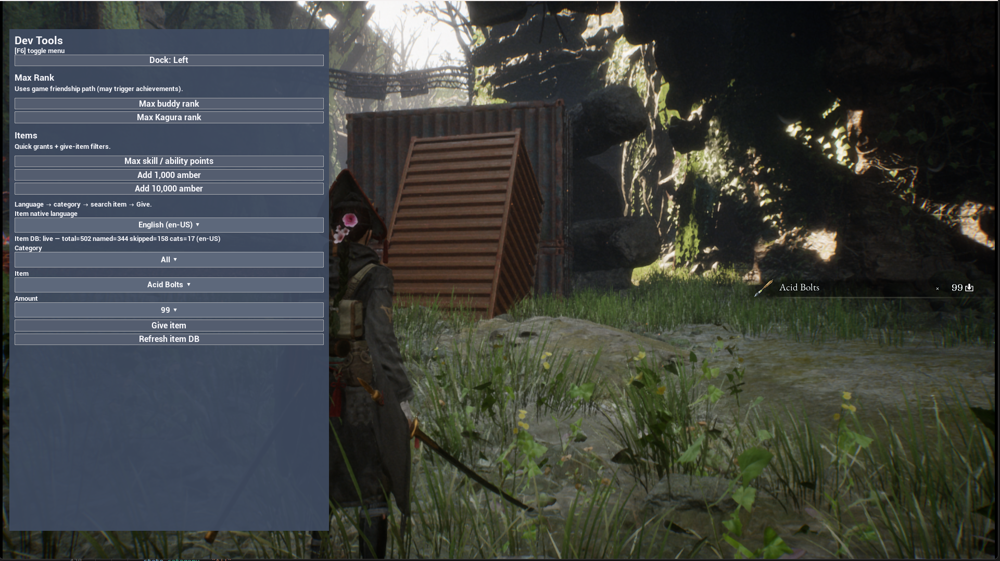

# ModMenu

ModMenu is a lightweight UI framework for UE4SS Lua mods that lets feature modules register reusable in-game settings panels without each mod reimplementing its own ImGui or UMG shell.



*Example: `DevToolsMasterMod` — F6 in-game panel built with ModMenu (Beast of Reincarnation).*

One panel, one hotkey. Feature modules **register sections** into that shell — they do not each create their own UI.

Reference host: `Mods/DevToolsMasterMod/`

---

## Layout on disk

```
ue4ss/Mods/
  shared/
    ModMenu/
      ModMenu.lua           ← public API + shell
      core/                 ← util, umg, input, options
        util.lua
        umg.lua
        input.lua
        options.lua
      widgets/              ← one module per item type + registry
        init.lua
        separator.lua
        label.lua
        button.lua
        checkbox.lua
        dropdown.lua
      README.md
      GithubAssets/         ← screenshots for docs (optional)
    UEHelpers/              ← already required by UE4SS layouts
  YourHostMod/
    enabled.txt
    Scripts/
      main.lua              ← Init + Register feature modules
      myfeature.lua         ← optional: section logic
```

Require path (same style as UEHelpers):

```lua
local ModMenu = require("ModMenu.ModMenu")
```

The host mod must be enabled (`enabled.txt` / `mods.txt`). The `shared/ModMenu` folder is loaded via `require`; it is not a separate enabled mod.

### Player / Nexus zip (runtime only)

Ship the host **and** the ModMenu runtime tree. Omit docs and screenshots:

```
Mods/YourHostMod/
Mods/shared/ModMenu/ModMenu.lua
Mods/shared/ModMenu/core/*.lua
Mods/shared/ModMenu/widgets/*.lua
```

Do **not** require `README.md` or `GithubAssets/` in the zip (use gallery images on Nexus instead).

---

## Recommended pattern

**One host mod owns the shell.** Feature scripts only call `Register` / `Get` / `Set` / etc.

### Host — `Scripts/main.lua`

```lua
local ModMenu = require("ModMenu.ModMenu")
local MyFeature = require("myfeature")

ModMenu.Init({
    title = "My Mod Menu",
    key = Key.F6,
    keyHint = "F6",
    dock = "left", -- "left" | "right"
})

MyFeature.RegisterMenu(ModMenu)

print("[YourHostMod] Loaded — F6 opens menu")
```

### Feature — `Scripts/myfeature.lua`

```lua
local M = {}

---@param ModMenu table
function M.RegisterMenu(ModMenu)
    ModMenu.Register({
        id = "MyFeature",           -- stable unique id (re-Register replaces)
        title = "My Feature",       -- section header
        items = {
            {
                type = "label",
                label = "Short hint for players.",
            },
            { type = "separator" },
            {
                type = "button",
                id = "doThing",
                label = "Do thing",
                onClick = function()
                    -- your game logic
                end,
            },
            {
                type = "checkbox",
                id = "enabled",
                label = "Enabled",
                default = false,
                onChange = function(on)
                    print("enabled = " .. tostring(on))
                end,
            },
            {
                type = "dropdown",
                id = "mode",
                label = "Mode",
                options = {
                    "Simple",
                    { label = "Advanced", value = "adv" },
                },
                default = "Simple",
                onChange = function(value)
                    print("mode = " .. tostring(value))
                end,
            },
        },
    })
end

return M
```

### Why this shape?

| Role | Responsibility |
|------|----------------|
| Host | `Init` once (title, key, dock), wire features |
| Feature module | Own section `id`, items, callbacks, game calls |
| ModMenu | Draw panel, input, values store, dock |

Shipping extra cheats later = add another `*.lua` + one `RegisterMenu` call in the host. Do **not** publish a second mod that also `Init`s a different hotkey unless you intentionally want a second shell (not supported as two independent panels today — ModMenu is a singleton).

---

## API

### `ModMenu.Init(opts?)`

Configure and bind the singleton. Safe to call more than once (updates config).

| Option | Default | Notes |
|--------|---------|--------|
| `title` | `"Mod Menu"` | Header title |
| `key` | `Key.F6` | Toggle key |
| `keyHint` | `"F6"` | Shown in the header hint |
| `dock` | `"right"` | `"left"` \| `"right"` |
| `widthFrac` | `0.32` | Panel width as % of viewport |
| `topFrac` / `bottomFrac` | `0.05` | Vertical margins |
| `rightFrac` | `0.01` | Edge margin (both docks) |
| `fontTitle` / `fontHint` / `fontItem` / `fontSection` | 32 / 20 / 24 / 26 | Optional |

Also installs viewport hooks, LMB click latch, and the toggle keybind.

### `ModMenu.Register(section)`

Add or **replace** a section by `section.id`. If the menu is open, content rebuilds.

```lua
{
  id = "UniqueId",       -- required
  title = "Display",     -- optional; defaults to id
  items = { ... },       -- required array
}
```

### Values

```lua
ModMenu.Get(sectionId, itemId)           -- checkbox bool / dropdown value
ModMenu.Set(sectionId, itemId, value)    -- sync store + live widget
```

Keys are stored as `"SectionId.itemId"`.

### Labels

```lua
ModMenu.SetLabel(sectionId, itemId, "New text")
```

Label items need an `id` for this to work.

### Dropdown options

```lua
-- Replace options; optionally set or clear selection
ModMenu.SetOptions(sectionId, itemId, options, selectedValue)
ModMenu.SetOptions(sectionId, itemId, options, false)  -- clear selection
```

- Searchable dropdowns refresh rows **in place** when the menu is open.
- Non-searchable dropdowns rebuild the panel.

### Lifecycle

```lua
ModMenu.OnOpen(function()
    -- lazy load DBs, refresh status, etc.
end)

ModMenu.Open()
ModMenu.Close()
ModMenu.Toggle()
ModMenu.IsOpen()           -- boolean
ModMenu.ListSections()     -- { "MaxRank", "Items", ... }
ModMenu.SetDock("left")
ModMenu.GetDock()
```

`OnOpen` runs each time the menu finishes opening (after the shell is visible). Register as many callbacks as you need (e.g. one per feature).

---

## Extending: widget contract

Item types live under `widgets/`. The shell never hard-codes control UMG — it asks the registry.

### Contract

Each widget module returns a table:

| Field | Required | Role |
|-------|----------|------|
| `type` | yes | String id (`"button"`, …) |
| `validate(item, sectionId, index)` | no | Throw on bad Register fields |
| `seed(sectionId, item, values)` | no | Default into values store on Register |
| `build(ctx)` | yes | Construct UMG; append to `ctx.liveControls` |
| `poll(ctrl, ctx)` | no | Continuous tick (checkbox state, search filter) |
| `pollClick(ctrl, ctx)` | no | LMB click handler; return `true` if consumed |
| `apply(ctrl, value, ctx)` | no | Sync live widget from `ModMenu.Set` / `SetLabel` |

Dropdown also exposes helpers used by the shell (`refreshLive`, `collapseAll`, …).

### Build `ctx`

| Field | Purpose |
|-------|---------|
| `contentBox` | Parent vertical box |
| `section` / `item` | Current section + item |
| `namePrefix` | Unique FName prefix |
| `values` / `liveControls` | Shared store + control records |
| `config` | Fonts / layout from `Init` |
| `umg` | `ModMenu.core.umg` |
| `Input` | `ModMenu.core.input` |
| `ValueKey` / `SafeCall` / `IsValid` | Helpers |
| `ReclaimMenuInput` / `EnsureMenuVisible` | Shell input helpers |

### Adding a new type (PR checklist)

1. Create `widgets/<type>.lua` implementing the contract (copy `button.lua` or `checkbox.lua`).
2. `register(require("ModMenu.widgets.<type>"))` in `widgets/init.lua`.
3. Document fields under **Item types** below.
4. Smoke-test via a host `Register` section.

Natural follow-ons (not required for hosts): tabbed sections, `textinput`, `slider` / `number` widgets — same contract as above.

---

## Item types

Supported: `checkbox` | `button` | `dropdown` | `label` | `separator`  
(Implemented in `widgets/<type>.lua`.)

### `separator`

```lua
{ type = "separator" }
```

### `label`

```lua
{ type = "label", label = "Hint text" }
{ type = "label", id = "status", label = "Ready" }  -- id required for SetLabel
```

### `button`

```lua
{
  type = "button",
  id = "run",
  label = "Do thing",
  onClick = function() end,
}
```

### `checkbox`

```lua
{
  type = "checkbox",
  id = "enabled",
  label = "Enabled",
  default = false,
  onChange = function(checked) end,
}
```

### `dropdown`

Options may be plain strings or `{ label, value }` tables:

```lua
options = {
  "A",
  { label = "Bee", value = "b" },
}
```

**Simple (short lists):**

```lua
{
  type = "dropdown",
  id = "mode",
  label = "Mode",
  options = { "A", "B" },
  default = "A",
  onChange = function(value) end,
}
```

**Searchable (long lists — filter field + scroll):**

```lua
{
  type = "dropdown",
  id = "item",
  label = "Item",
  searchable = true,
  placeholder = "Select item...",
  maxVisible = 400,      -- cap on built option rows (raise carefully)
  listMaxHeight = 320,   -- scroll area height
  allowEmpty = true,     -- ok with no selection / empty filter results
  options = { { label = "Potion", value = "ITEM_ID" }, ... },
  default = nil,
  onChange = function(value) end,
}
```

| Field | Notes |
|-------|--------|
| `searchable` | Custom picker (not ComboBoxString) |
| `maxVisible` | Max option rows constructed; leftover shows “type to narrow” |
| `listMaxHeight` | ScrollBox height hint |
| `allowEmpty` | Allow cleared / placeholder state |
| `placeholder` | Header text when nothing selected |

---

## Dynamic UI patterns

### Update options without rebuilding the whole section

```lua
ModMenu.SetOptions("Items", "item", newOpts, false)
ModMenu.Set("Items", "item", nil)
```

Prefer this for category filters on a searchable list (see DevTools `items.lua`).

### Swap which controls exist

Re-call `Register` with the same `id` and a new `items` array (e.g. show Category only for English). Values for ids that still exist are kept when possible; seed `default` on first register.

### Lazy work on open

```lua
ModMenu.OnOpen(function()
    if alreadyLoaded then return end
    ExecuteWithDelay(50, function()
        -- fetch DB, then SetOptions / SetLabel / Register
    end)
end)
```

Heavy work on the click stack can hitch or crash — delay off the open path when loading large lists.

---

## Behaviour notes (for integrators)

1. **Singleton** — one ModMenu instance per process. Multiple hosts both calling `Init` share the same panel; last `Init` options win for title/key/dock.
2. **Input** — while open, uses GameAndUI + mouse cursor. Clicks use LMB keybind latch + `IsHovered()` (not UE `OnClicked` alone).
3. **Dock** — left/right presets only (header button + `SetDock`). No free drag. Session only (not saved to disk).
4. **FNames** — content rebuilds bump an internal generation so widget names stay unique after `ClearChildren`. Prefer `SetOptions` on searchable lists over constant full rebuilds.
5. **Large lists** — keep `maxVisible` bounded; filter narrows the working set. Building thousands of UButtons at once is risky.
6. **Game readiness** — many game objects only exist after a save is loaded; surface that in a status `label` and/or `OnOpen` retry.
7. **Callbacks** — errors inside `onClick` / `onChange` are caught and logged as `[ModMenu] callback error: ...`.

---

## Minimal standalone host

If you only need one section and no feature files:

```lua
-- Mods/MyCheatMenu/Scripts/main.lua
local ModMenu = require("ModMenu.ModMenu")

ModMenu.Init({ title = "My Cheats", key = Key.F7, keyHint = "F7", dock = "right" })

ModMenu.Register({
    id = "Cheats",
    title = "Cheats",
    items = {
        {
            type = "button",
            id = "heal",
            label = "Heal",
            onClick = function()
                -- ...
            end,
        },
    },
})
```

Ship `MyCheatMenu/` **and** the full ModMenu runtime (`ModMenu.lua` + `core/` + `widgets/`). See **Player / Nexus zip** above.

---

## See also

- Host: `Mods/DevToolsMasterMod/Scripts/main.lua`
- Simple section: `Mods/DevToolsMasterMod/Scripts/maxrank.lua`
- Dynamic searchable section: `Mods/DevToolsMasterMod/Scripts/items.lua`
- Widget registry: `widgets/init.lua`
