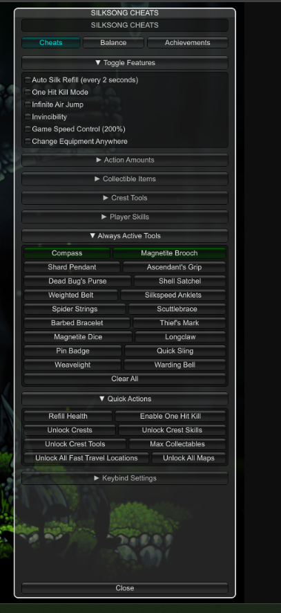

# ModMenu Vision

North-star plan for polishing ModMenu into a dense, scannable in-game settings shell — inspired by the Silksong cheats panel (Unity), built on UE4SS + constructed UMG.

This is a living checklist. Check items off as they ship. No requirement to finish a whole phase in one sitting.



---

## North star

A host mod can ship a **cheat / tools panel** that feels intentional:

- Clear hierarchy: **title → tabs (optional) → collapsible sections → controls**
- Dense but readable (collapse + tabs beat one endless scroll)
- Obvious interactive state (hover, checked, active / armed)
- Light and dark theme presets (host-selectable)
- Same API shape hosts already use (`Init` / `Register` / widgets)
- Still works across **UE4.27+ and UE5** without per-game forks in ModMenu core

Reference feel: Silksong-style cheats UI — tabs, collapsible groups, checkbox lists, 2-column action grids, strong active borders — adapted to UMG constraints (no CSS; brushes, padding, fonts, slots).

---

## Principles

1. **Framework, not a game mod** — ModMenu stays game-agnostic. Host mods own game-specific quirks (custom cursors, pause locks, native utils).
2. **Theme tokens over magic numbers** — colors / spacing / radii live in one place; widgets read tokens.
3. **Widget contract stays sacred** — new control types = new `widgets/*.lua` + registry + bundle entry + README.
4. **Defaults stay boring** — readable out of the box; denser “Silksong-like” looks are opt-in via `Init`.
5. **Polish in layers** — visual tokens first, then IA (collapse / tabs), then new control types.
6. **UE4 / UE5 parity** — probe / fallback for engine arity; never assume flush-input or Enhanced Input.

---

## Current baseline (today)

### Done / solid

- [x] Multi-file source + `npm run deploy` bundle into `shared/ModMenu/`
- [x] Per-mod shell (`Init`, instance ids, viewport Z, key claims)
- [x] Sections + item registry (`checkbox`, `button`, `dropdown`, `label`, `separator`)
- [x] Dock left / right, layout fractions, font size knobs
- [x] Open lifecycle (`OnOpen`); open / close / toggle API
- [x] Multi-menu open-count (don’t yank GameOnly while another shell is open)
- [x] UE4 / UE5 `SetInputMode_*` arity fallback (`bFlushInput`)
- [x] Force cursor + click/hover + look-ignore while menu open (engine path)

### Intentionally out of ModMenu core

- [x] Game-specific software cursors (e.g. Thymesia `NativeUtils` / UIPage stack) — host responsibility; document as known limit

### Gaps vs north star

- [ ] Theme token system (colors, spacing) — colors mostly hardcoded
- [ ] Light / dark presets
- [x] Collapsible sections
- [ ] Tabs / section groups
- [ ] Button / checkbox visual polish (states, grids)
- [ ] Close affordance in chrome (optional)
- [x] Extra widget types (`number`, `textinput`, `row`; `slider` still open)

---

## Phase 0 — Foundation docs & smoke hosts

Goal: make the north star easy to work toward without re-discovering constraints.

Source layout and install paths are documented in README. Vision features (themes, collapse, tabs) can start.

- [ ] Keep this file updated as phases complete
- [x] README: short “Theming & polish” stub linking here
- [x] README: source layout + install documented
- [x] README: known limits (custom game cursors; host must show glyph if engine cursor is suppressed)
- [ ] Maintain at least one simple host smoke section (DevTools-style) for visual checks on UE5 + one UE4 title when available

**Exit:** contributors know what “done” looks like and what ModMenu will never own.

---

## Phase 1 — Theme tokens

Goal: one day-ish pass that makes every control look intentional without changing IA.

### Design

- [ ] Introduce `config.theme` (or flat color keys) resolved in `Init`
- [ ] Ship two presets: `dark` (default, close to current) and `light`
- [ ] Token list (minimum):
  - [ ] `panelBg`, `panelBorder`
  - [ ] `textPrimary`, `textMuted`, `textAccent`
  - [ ] `buttonBg`, `buttonBgHover` (hover optional / best-effort)
  - [ ] `checkbox`, `separator`
  - [ ] `dropdownHeader`, `dropdownOption`, `dropdownActive`
  - [ ] `sectionTitle`
  - [ ] padding / spacer scale (`padPanel`, `gapItem`, `gapSection`)
- [ ] Pass theme through widget `ctx` (already has `config`)
- [ ] Replace hardcoded colors in `shell/build.lua` + `widgets/*` + `core/umg.lua` helpers

### API sketch

```lua
ModMenu.Init({
    title = "Dev Tools",
    theme = "dark", -- or "light"
    -- optional overrides:
    -- colors = { panelBg = { R=..., G=..., B=..., A=... }, ... }
})
```

### Verify

- [ ] Dark preset ≈ current look (no host breakage)
- [ ] Light preset readable on bright game backdrops
- [ ] Dropdown / button / checkbox all consume tokens
- [ ] Deploy + smoke on one UE5 game

**Exit:** hosts can switch light/dark; contributors never hardcode one-off hex in widgets without a token.

---

## Phase 2 — Collapsible sections

Goal: biggest UX win for large cheat menus (Silksong-style groups).

### Design

- [x] `Register` section fields:
  - [x] `collapsible` (default `false` — existing sections stay always-open)
  - [x] `collapsed` initial state (requires `collapsible`)
  - [x] optional `onToggle(collapsed)` callback
- [x] Section header row: title left, `+` / `-` right (accordion) as a full-width click target
- [x] Persist collapse state for the session (per section id); optional later: disk persistence
- [x] Rebuild children without breaking FName / zombie widget rules (`contentGen` discipline)
- [x] Toggle via show/hide of a section body (dropdown pattern — no rebuild-under-click flicker)

### Verify

- [ ] Many sections stay scannable
- [ ] Collapse/expand while open doesn’t break click latch / dropdowns
- [ ] Multi-mod: each shell tracks its own collapse state

**Exit:** a 30-item cheat menu is usable without scrolling forever.

---

## Phase 3 — Control polish

Goal: make existing types feel finished (still no tabs).

- [ ] Checkbox: clearer on/off affordance (aligned label, stronger checked state)
- [ ] Button: consistent height, padding, optional `variant` (`default` | `danger` | `accent`)
- [ ] Dropdown: active option styling; cleaner search field chrome
- [ ] Label / separator: muted hierarchy under theme tokens
- [ ] Hover feedback where UMG constructed controls allow (best-effort; document limits)
- [ ] Optional header **Close** control (calls `Close`) — Silksong-style footer or header action
- [ ] Optional status line slot under title (hint already exists — refine typography)

### Verify

- [ ] Side-by-side screenshot: Phase 0 vs Phase 3 on same host
- [ ] No regression to click reliability / reclaim input

**Exit:** “MVP chrome” → “polished tool” without new IA.

---

## Phase 4 — Layout density (grids)

Goal: Silksong-like Quick Actions / tool banks.

- [ ] Section or item-group option: `columns = 2` (maybe 3 later)
- [ ] Button (and maybe checkbox) flow into a uniform grid
- [ ] `Clear All` / full-width row helper (span all columns) — API TBD (`fullWidth = true` on item)
- [ ] Theme tokens for grid gap

### Verify

- [ ] 6–12 quick actions readable in two columns
- [ ] Dock left/right still layout-correct at default `widthFrac`

**Exit:** action banks don’t force a mile-long vertical list.

---

## Phase 5 — Tabs / section groups

Goal: Silksong Cheats | Balance | Achievements style IA.

### Design options (pick one in implementation)

- **A.** `Init({ tabs = { "Cheats", "Balance" } })` + `Register({ tab = "Cheats", ... })`
- **B.** Parent groups: `RegisterGroup({ id, title })` then sections reference `group`

Prefer **A** if tabs are primarily top-level navigation.

- [ ] Tab strip chrome under title (active underline / accent — theme tokens)
- [ ] Only build / show sections for active tab (or collapse others)
- [ ] Remember last tab for the session
- [ ] Keyboard optional later (Q/E or bumper-style) — not required for v1 tabs

### Verify

- [ ] Host with 3 tabs × several sections feels like the Silksong reference
- [ ] Register-while-open still rebuilds correctly

**Exit:** information architecture matches the north-star screenshot.

---

## Phase 6 — New widget types

Goal: fill common cheat-menu controls (same widget contract).

Priority order:

- [ ] `slider` (float / int display + optional step)
- [x] `number` (EditableTextBox + parse/clamp; stepper polish optional)
- [x] `textinput` (EditableTextBox; poll GetText — do not reclaim on keystroke)
- [x] `row` (HorizontalBox group for label/field/button on one line)
- [ ] `radio` or single-choice button group (if dropdown isn’t enough)
- [ ] `button` grid already covered in Phase 4 — ensure docs show patterns

Each type:

- [ ] `widgets/<type>.lua` + registry + README fields (`widgets/*.lua` are auto-bundled)
- [ ] Theme-token styling
- [ ] Smoke Register example

**Exit:** hosts rarely need custom UMG for standard cheat affordances.

---

## Phase 7 — Quality bar & showcase

Goal: meaningful “finished” for the north-star journey.

- [ ] Showcase host (or README gallery) demonstrating tabs + collapse + grid + themes
- [ ] Screenshots: dark + light; UE5 title; UE4 title if practical
- [ ] Compat matrix blurb (input arity, cursor engine path vs game-specific glyph)
- [ ] Performance sanity: large menu (50+ items) open/close / collapse
- [ ] Changelog / release notes for the polish milestone

**Exit:** you can point at ModMenu and say the Silksong-inspired vision shipped — within UMG reality.

---

## Non-goals (unless requirements change)

- Drag-anywhere free placement (dock presets are enough)
- Full CommonUI / Enhanced Input redesign
- Per-game cursor widget bundling (hosts own glyphs)
- Pixel-perfect Unity IMGUI clone
- Designer-authored WBP dependency (stay constructed-UMG so `shared/ModMenu` remains drop-in)

---

## Suggested working rhythm

1. One phase (or even one checkbox group) per PR / session.
2. Always `npm run deploy` + in-game smoke before checking an item off.
3. Prefer token / API additions that don’t break existing `Register` tables.
4. When tempted by game-specific hacks, put them in the host mod and add a line under **Intentionally out of ModMenu core**.

---

## Quick reference — Silksong → ModMenu mapping

| Silksong affordance        | ModMenu phase        |
|----------------------------|----------------------|
| Dark panel + accent tabs   | Phase 1 + 5          |
| Collapsible groups         | Phase 2              |
| Checkbox feature list      | Phase 3 (polish)     |
| 2-col tool / action grids  | Phase 4              |
| Active green borders       | Phase 1 tokens + 3   |
| Close button               | Phase 3              |
| Keybind settings section   | Host content; collapse Phase 2 |

---

## Status

| Phase | Name                 | Status |
|-------|----------------------|--------|
| 0     | Foundation docs      | Done (docs) |
| 1     | Theme tokens         | Not started |
| 2     | Collapsible sections | Done (code) |
| 3     | Control polish       | Not started |
| 4     | Layout density       | Not started |
| 5     | Tabs / groups        | Not started |
| 6     | New widget types     | Not started |
| 7     | Quality & showcase   | Not started |

Update the table as phases complete (`Not started` → `In progress` → `Done`).
